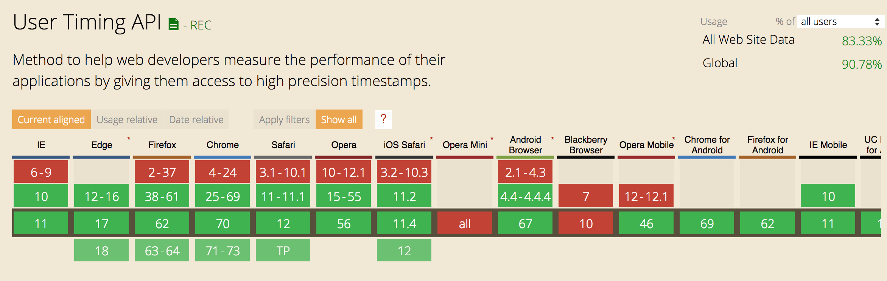

<!-- .slide: data-background="./images/hero_bg.jpg" -->
<h1 class="title dark-background"><span class="translucent">Front-End Performance &amp;</span> <br />🍹 RUM 🍹</h1>
<h2 class="subtitle">Sia Karamalegos</h2>

---

## hi, i'm sia


---

# Performance Metrics

Note: Does anyone know what the Pareto principle is?

---

## Pareto Principle

Roughly 80% of the effects come from 20% of the causes.

Note: So what does this mean?

---

## Be lazy. Only optimize the worst offenders.


---

## Which metrics matter?

- ~~Load time~~ Speed index
- Time to interactive
- Jank / responsiveness

---

## Speed Index

Measures how quickly the page contents are visually populated

- Expressed in milliseconds
- Dependent on size of the view port
- Use [webpagetest.org](https://www.webpagetest.org/) to measure your pages

> Note: It is particularly useful for comparing experiences of pages against each other (before/after optimizing, my site vs competitor, etc) and should be used in combination with the other metrics (load time, start render, etc) to better understand a site's performance. Historically we have relied on milestone timings to determine how fast or slow web pages were.  The most common of these is the time until the browser reaches the load event for the main document (onload).  The load event is easy to measure both in a lab environment and in the real world.  Unfortunately, it isn't a very good indicator of the actual end-user experience.  As pages grow and load a lot of content that is not visible to the user or off the screen (below the fold) the time to reach the load event is extended even if the user-visible content has long-since rendered. Lighthouse may use a node module called Speedline for this.

<small>https://sites.google.com/a/webpagetest.org/docs/using-webpagetest/metrics/speed-index</small>

---

## Time to Interactive

<iframe width="560" height="315" src="https://www.youtube.com/embed/Lx1cYJAVnzA" frameborder="0" allow="autoplay; encrypted-media" allowfullscreen></iframe>

<small>End to End Apps with Polymer by Kevin Schaaf, Polymer Summit 2017</small>

Note: the point at which layout has stabilized, key webfonts are visible, and the main thread is available enough to handle user input.

---

## Jank or Responsiveness


Note: Frame rate or frames per second (fps), is one measure of responsiveness. Modern devices refresh their screens at a rate of 60 fps. Converting that to an individual frame, we theoretically have 16 ms to render. In actuality, the browser needs some of that time, so we should target 10ms per frame. Any more, and the human eye will be able to detect the jank or jitter.

---

## Optimizing Load and Speed Index

Use WebPageTest and the DevTools network tab.

<video controls autoplay loop>
  <source src="./images/devtools_network.mp4" type="video/mp4">
  <p>Your browser doesn't support HTML5 video. Here is
     a <a href="https://i.gyazo.com/5164aab2cec42a31c6014a21c7b78f43.mp4">link to the video</a> instead.</p>
</video>

---

## Optimizing Responsiveness

Use DevTools performance tab.


Note: How does this image make you feel? Do you know what this comes from? How confident are you in your use of DevTools?

---

# Synthetic Testing vs Real User Monitoring

Note: What did all the metrics in the previous section have in common? They were all versions of active monitoring using synthetic tests.

---

## 🍹 Real User Monitoring (RUM) 🍹

> Real user monitoring data is used to determine the actual service-level quality delivered to end-users and to detect errors or slowdowns on web sites.

<small>[Wikipedia](https://en.wikipedia.org/wiki/Real_user_monitoring)</small>

Note: Great for things like finding out your CDN provider doesn't serve a particular location well.

---

## RUM Using JavaScript APIs

- **Navigation Timing API** collects performance metrics for HTML documents
- **Resource Timing API** collects performance metrics for document-dependent resources (css, scripts, images, etc.)
- **User Timing API** for custom timings

<small>
  https://developers.google.com/web/fundamentals/performance/navigation-and-resource-timing/
  <br />https://www.keycdn.com/blog/user-timing/
<small>

---

## Navigation and Resource Timing Usage

Navigation and Resource Timing (and related APIs) store performance entries in a performance entry buffer:

```javascript
// Get ALL the timings
performance.getEntries()

// Navigation Timing API entries
performance.getEntriesByType('navigation')

// Resource Timing API entries
performance.getEntriesByType('resource')

// Get timing data for an important hero image
var heroImageTime = performance.getEntriesByName("https://somesite.com/images/hero-image.jpg")

// Get timing data for an important hero image
var allTheTimings = performance.getEntries({
  // Get entries by name
  "name": "https://somesite.com/images/hero-image.jpg",
  // Get entries by type
  "entryType": "resource",
  // Get entries by their initiatorType value:
  "initiatorType": "img"
})
```

---

## Example Timing Data

```javascript
{
  "connectEnd": 152.20000001136214,
  "connectStart": 85.00000007916242,
  "decodedBodySize": 1270,
  "domComplete": 377.90000007953495,
  "domContentLoadedEventEnd": 236.4000000525266,
  "domContentLoadedEventStart": 236.4000000525266,
  "domInteractive": 236.2999999895692,
  "domainLookupEnd": 85.00000007916242,
  "domainLookupStart": 64.4000000320375,
  "duration": 377.90000007953495,
  "encodedBodySize": 606,
  "entryType": "navigation",
  "fetchStart": 61.600000015459955,
  "initiatorType": "navigation",
  "loadEventEnd": 377.90000007953495,
  "loadEventStart": 377.90000007953495,
  "name": "https://example.com/",
  "nextHopProtocol": "h2",
  "redirectCount": 0,
  "redirectEnd": 0,
  "redirectStart": 0,
  "requestStart": 152.50000008381903,
  "responseEnd": 197.80000008177012,
  "responseStart": 170.00000004190952,
  "secureConnectionStart": 105.80000001937151,
  "startTime": 0,
  "transferSize": 789,
  "type": "navigate",
  "unloadEventEnd": 0,
  "unloadEventStart": 0,
  "workerStart": 0
}
```

Note: Times are in milliseconds

---

## Resource and Navigation Timings are great for measuring...

- DNS lookup time
- Connection and TLS negotiation times
- Cache seek plus response time
- Service worker plus response time
- Request plus response time
- Download time
- Time to first byte
- Document unloading
- Redirects
- Timing for a specific resource (e.g., image)
- Stuff to the millisecond

---

## User Timing API

```javascript
// Add a timing called 'start'
performance.mark('start')

// Add a timing called 'end'
performance.mark('end')

// Measure the difference between 'start' and 'end'
// and call it 'difference'
performance.measure('difference', 'start', 'end')

// Clear a mark or a measure
performance.clearMarks('start')
performance.clearMeasures('difference')

// User Timing entries
performance.getEntriesByType('mark')
performance.getEntriesByType('measure')
```

<small>https://developer.mozilla.org/en-US/docs/Web/API/User_Timing_API</small>

---

## User Timing Sample Data

```javascript
{
  "duration": 0,
  "entryType": "mark",
  "name": "start",
  "startTime": 1719086.7,
}
```

```javascript
{
  "duration": 14219.5
  "entryType": "measure"
  "name": "difference"
  "startTime": 1719086.7
}
```

---

## User Timings are great for measuring...

- Specific events like:
  - Stylesheets done blocking
  - Hero image finished loading and blocking
  - Scripts done blocking
  - Fonts loaded
  - Specific text displayed (be careful of render-blocking fonts)
  - Suspected piece of long-running JavaScript
- Stuff to the microsecond

---

## User Timing is Available for 90+% of Users

Resource timing is similar, and Navigation timing is around 93%.



<small>https://caniuse.com/#feat=user-timing</small>

---

## Use a check to avoid weirdness

```javascript
if (performance.getEntriesByType("navigation").length > 0) {
  // Yay, we have Navigation Timing stuff!
}
```

---

# Should I send all my perf data?

---

# No!

**Measuring performance shouldn't result in lower performance.**

Note: So what does this mean we should do?

---

# Be selective in the data you send.

Note: What is the most critical element on the page that tells the user it is finished loading? E.g. maybe title for a blog. How does the user interact with the page? Measure those key timings. Maybe only do it temporarily to profile your app. You can always dive deeper if you discover a problem.

---

# Don't block the main thread.

Process events in < 50ms

<small>https://developers.google.com/web/fundamentals/performance/rail</small>

---

## Option 1: `requestIdleCallback()`

- Queues a function to be called during a browser's idle periods.
- Use the timeout option to make sure it eventually runs.
- Minuses:
  - Only available in Firefox, Chrome, and Android-related browsers (only 72% worldwide).
  - User could navigate away or close the window before it runs.

<small>https://developer.mozilla.org/en-US/docs/Web/API/Window/requestIdleCallback</small>

---

## Option 2: `navigator.sendBeacon()` on `visibilityChange`

- Allows us to send an asynchronous request without delaying the next action (e.g., navigation).
- Executes when the User Agent has the opportunity to do so.
- Doesn't wait for a response.
- Minuses:
  - Available in more browsers (86% worldwide), but not all.
  - User agents restrict how much data may be sent, and could reject a larger request.

<small>https://developer.mozilla.org/en-US/docs/Web/API/Navigator/sendBeacon</small>

---

## `navigator.sendBeacon()` in action

```javascript
window.addEventListener("visibilitychange", function() {
  // Caution: If you have a _lot_ of performance entries, don't send _everything_ via getEntries. This is just an example.
  let rumData = new FormData();
  rumData.append("entries", JSON.stringify(performance.getEntries()));

  // Check for sendBeacon support:
  if("sendBeacon" in navigator) {
    // Queue beacon request and inspect for failure
    if(navigator.sendBeacon(endpoint, rumData)) {
      // sendBeacon worked! We're good!
    } else {
      // sendBeacon failed! Use XHR or fetch instead
    }
  } else {
    // sendBeacon not available! Use XHR or fetch instead
  }
}, false);
```

---

## In Summary...

- Be lazy. Only optimize the worst offenders.
- Measure speed index, time to interactive, and responsiveness.
- **RUM** allows us to measure actual service-level quality delivered to end-users and to detect errors or slowdowns on web sites.
- Three great APIs exist for performance timing:
  - **Navigation Timing API** collects performance metrics for HTML documents
  - **Resource Timing API** collects performance metrics for document-dependent resources (css, scripts, images, etc.)
  - **User Timing API** for custom timings
- Don't send too much data (select most important).
- Don't lock up the main thread to send data (use `navigator.sendBeacon`).


---

<!-- .slide: data-background="./images/hero_bg.jpg" -->
<h1 class="title dark-background">Thanks!</h1>
Slides, resources, and more at <a href="https://bit.ly/siaspeaks" class="dark-background">bit.ly/siaspeaks</a>

<!-- TODO:
 add how to do with GA
 live example and how it shows up in DevTools - like Umar's
 mention 50ms rule for JS?
 -->